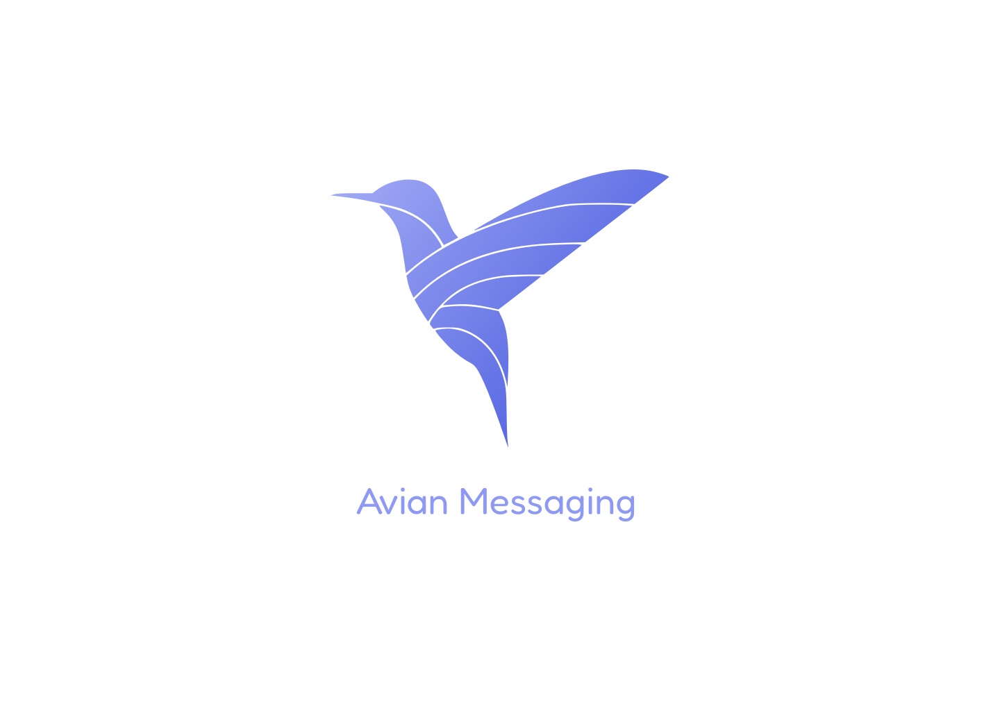

## Features ⚡
- [x] Dark and light themes
- [x] Message attachments
- [x] Replies and pins
- [x] Voice calls
- [x] Settings
- [x] Archive conversations
- [x] Notifications

<br/>
<br/>


## Setup 🔧

<p>1. Clone the repository.</p>

```bash
git clone https://github.com/demon-bixia/Avian.git
```

<p>2. Install dependencies.</p>

```bash
npm install
```

<p>3. Run the development server.</p>

```bash
npm run dev
```
<br/>
<br/>

## Resources 📙

<p>The resources used in this project are:</p>

- <a href="https://pinia.vuejs.org/">Pinia</a>
- <a href="https://heroicons.com/">Heroicons</a>
- <a href="https://github.com/delowardev/vue3-emoji-picker">Vue3 Emoji Picker</a>
- <a href="https://vueuse.org/">vueuse</a>
- <a href="https://www.figma.com/file/P4anyRLoN2NNhDicfFUcqi/Avian-Messaging?node-id=2%3A4">Figma File</a>
