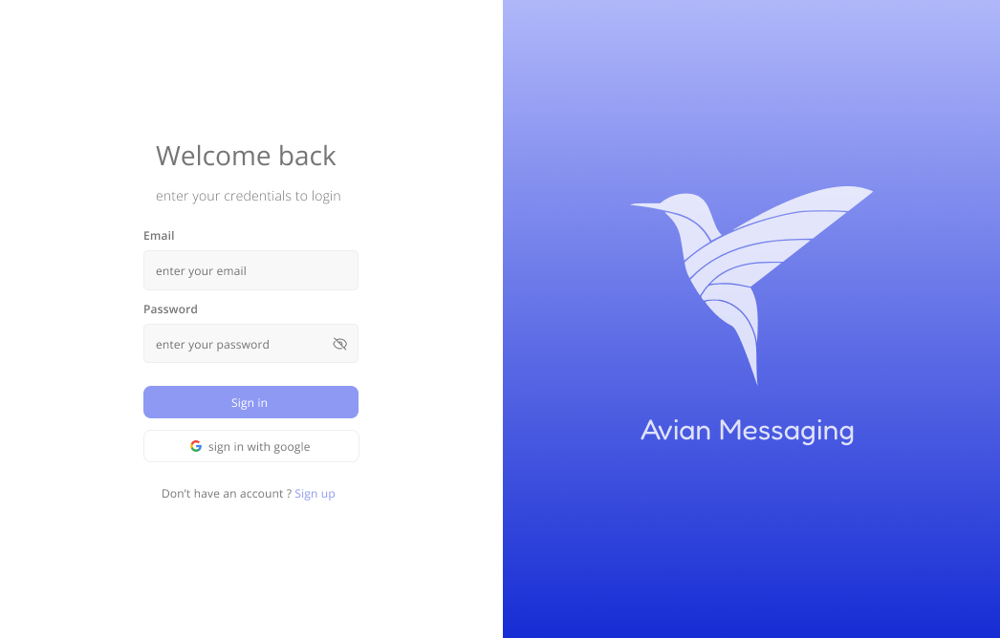
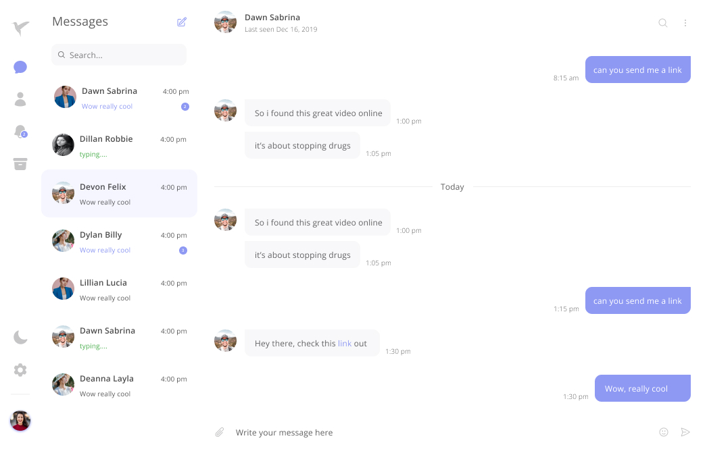
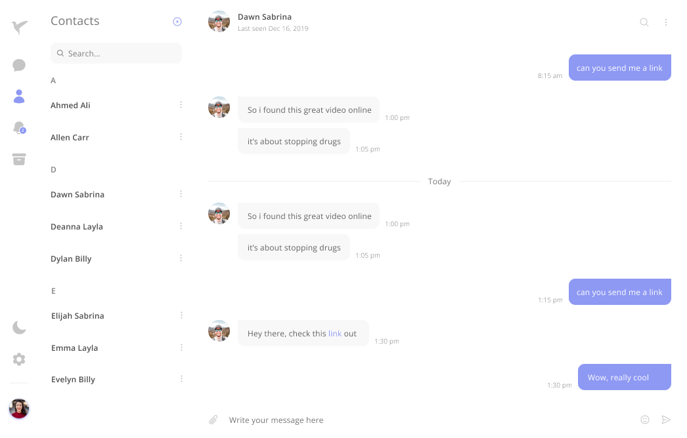
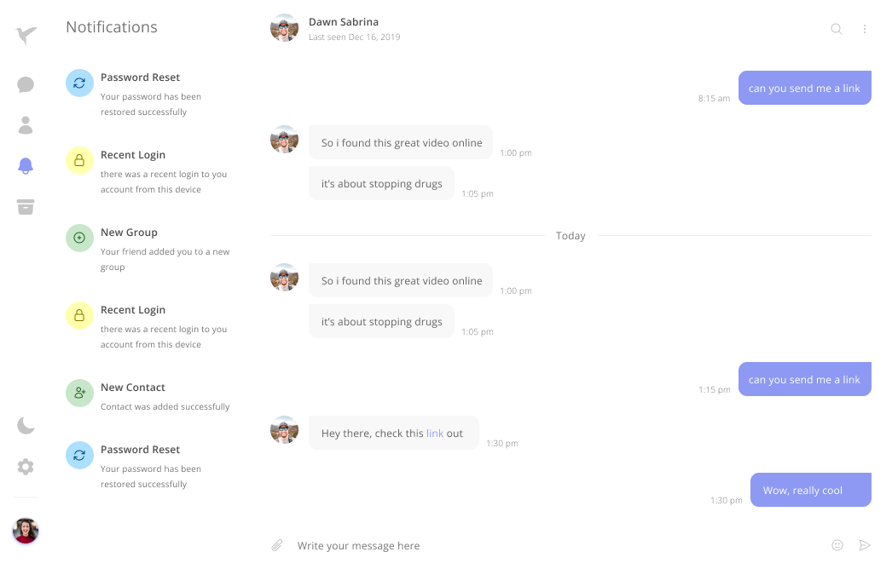

## Resources

<p>The resources used in this project are:</p>

- <a href="https://vuejs.org/">Vue 3</a>
- <a href="https://pinia.vuejs.org/">Pinia</a>
- <a href="https://tailwindcss.com/">Tailwind CSS</a>
- <a href="https://heroicons.com/">Heroicons</a>
- <a href="https://www.figma.com/file/P4anyRLoN2NNhDicfFUcqi/Avian-Chat?node-id=0%3A1">Design System</a>

## Setup

<p>1. Clone the repository.</p>

```bash
git clone https://github.com/demon-bixia/Avian.git
```

<p>2. Install dependencies.</p>

```bash
npm install
```

<p>3. Run the development server.</p>

```bash
npm run dev
```

## Design



<p>login page</p>

<br/>


<p>messages page</p>

<br/>


<p>contacts page</p>

<br/>


<p>notifications page</p>

<br/>


<p>archives messages page</p>

<br/>